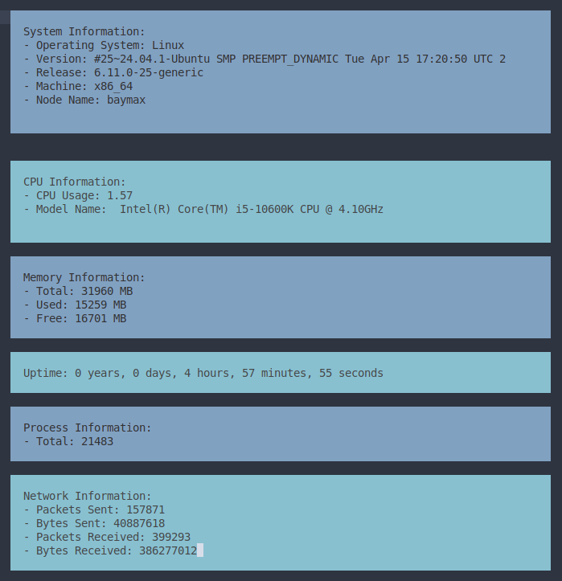

# LinuxTaskmanager
A simple Task Manager for Linux system.



## Cloning the Repository

To get started, clone the repository using the following command:

```bash
git clone https://github.com/khalidhasananik/LinuxTaskmanager.git
cd LinuxTaskmanager
```

## 🚀 Requirements

To compile and run this C program, ensure the following are installed on your system:

- A C compiler such as GCC or Clang
- The ncurses library

## 🛠️ Installation (Linux)

```bash
# Install GCC
sudo apt update
sudo apt install build-essential

# Install ncurses library
sudo apt install libncurses5-dev libncursesw5-dev
```

## 🧪 Compilation Example

To compile the program:

```bash
gcc some.c -o some -lncurses
```

Then run it:

```bash
./some
```

## 😊 Happy Coding!


